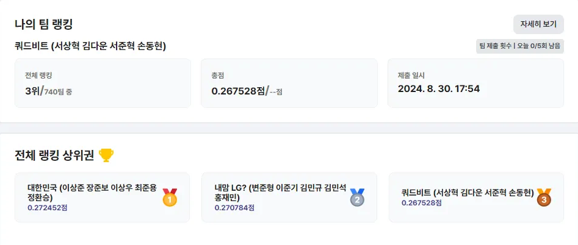
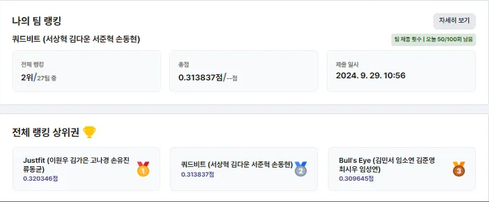

# LG Aimers 5th Product Abnormality Detection
### Abstract

With recent advances in machine learning models, there has been a growing effort to proactively predict product abnormalities during the production stage. In this competition, we implemented models that determine abnormality using various process data and compared their performance. Accordingly, our team undertook a project utilizing data from an LG Display factory to perform actual abnormality detection.

---

<h3> 👪 Team Members </h3>
<table>
  <tr>
    <td> 
  1 
 </td>
    <td> 
  2 
 </td>
    <td> 
  3 
 </td>
    <td> 
  4 
 </td>
  </tr>
  <tr>
    <td> 
 <b>Dong-hyun, Son</b> 
 </td>
    <td> 
 <b>Da-Woon, Kim</b> 
 </td>
    <td> 
 <b>Sang-hyeok, Seo</b> 
 </td>
    <td> 
 <b>Jun-hyeok, Seo (BuAs)</b> 
 </td>
  </tr>
  <tr>
    <td>  </td>
    <td>  </td>
    <td>  </td>
    <td>  </td>
  </tr>
  <tr>
    <td> 
 <a href="https://github.com/stat-thon">  
 </td>
    <td> 
 <a href="https://github.com/Daw-ny">  
 </td>
    <td> 
 <a href="https://github.com/devhyuk96">  
 </td>
    <td> 
 <a href="https://github.com/SeoBuAs">  
 </td>
  </tr>
</table>

---

### 🏆 Execution Results
- **LG Aimers 5th Online Hackathon** 
  - Public Rank: 4th (F1 : 0.2509)
  - Private Rank: 3rd (F1 : 0.2675)
  - Competitors: 740 teams
- **LG Aimers 5th Offline Hackathon**  
  - Public Rank: 3rd (F1 : 0.3106)
  - Private Rank: 2nd (F1 : 0.3138)
  - Competitors: 24 teams  
  - Overall: Finished 3rd (accounting for presentation score)

**Finally, We got Excellence Award from LG AI Research!**

<table>
  <tr>
    <td></td>
    <td></td>
  </tr>
</table>

---

### 📆 Project Procedure

You can check the detailed progress on our team's Notion.

https://sixth-drum-9ac.notion.site/LG-Aimers-5-7f95cb60d0164a279ae2e6575f7b8e80?pvs=4

---

